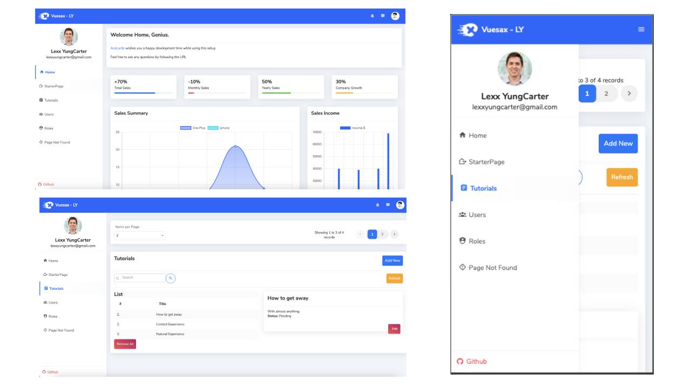

# Vue-Node-Expressjs-MongoDB-Mongoose Demo App
A demo project to showcase usage of vue and node-powered backend service.




## The Setup
`vue-js-client-crud` - Frontend code

`nodejs-express-mongodb` - Backend code

## Donating to the project
If you've found this useful and would like to buy the maintainers a coffee (or a Tesla, we're not picky), feel free to do so.

<a href="https://patreon.com/lexxyungcarter"> </a>

<a href="https://ko-fi.com/acelords" target="_blank" title="Buy me a Coffee"></a>

Or by buying products and merchandise at [Marketplace](https://store.acelords.space).

This funding is used for maintaining the project and adding new features into Code Style plus other open-source repositories.


## Demo Links
Front-End
`https://eager-galileo-1369f9.netlify.app/`

[Link](https://eager-galileo-1369f9.netlify.app/)

Backend
`Do you need it really?`

## Tech Stack
### Node
- Express - Obviously!
- bcryptjs + jsonwebtoken - Authentication
- cors - Allow specific domains to connect to backend
- Helmet - Added HTTP protection
- validatorjs - Return 'laravel-like' validation errors (Pretty DOPE!)
- mongoose-paginate-v2 - Paginate data from mongoose models
```
return {
    data: data.docs,
    meta: {
        total: data.totalDocs,
        per_page: data.limit,
        current_page: data.page,
        last_page: data.totalPages,
        from: data.page,
        to: data.docs.length,
        prev_page: data.prevPage,
        next_page: data.nextPage,
        has_prev_page: data.hasPrevPage,
        has_next_page: data.hasNextPage,
    },
}
```

```
current_page: 1
from: 1
has_next_page: true
has_prev_page: false
last_page: 3
next_page: 2
per_page: 3
prev_page: null
to: 3
total: 7
```

Read more on the `README` inside the node folder

### Frontend
- Vue + vue-router + vuex - Obviously!
- Vuesax - Beautiful Vue Admin Template
- SASS - Better/Faster CSS writing/mgmt
- Material Design Icons (mdi) - From the community
- axios - HTTP requests
- tailwindcss - Better grid + other helpful CSS utilities
- crypto-js - crypt variables stored in localStorage
- lodash - juicy!
- chart.js

OOP is highly used in the frontend setup. JavaScript classes in the `lib` folder are used 
to help separate the presentation layer from the logic layer. This makes it damn possible
to swap an entire template/UI and still maintain and reuse your JS objects 
with just a snap! - Thanos fans out there

Read more on the `README` inside the vue-js-client-crud folder

### Envoy
There is an additional Envoy file for easier deployments to production. Simply provide the 
username and server URL
```bash
envoy run update --user=root --ip=100.100.100.100
``` 

##### What Else?
Hmm..... let's see

...

Send PR! I'd really appreciate it!

## Credits
- [Lexx YungCarter](mailto:lexxyungcarter@gmail.com)
- [bezkoder.com/](https://bezkoder.com/) - Nice Tutorials

## Licence
- MIT

## Outro
Need help in setting up your own server, website, or just...talk?

Reach me via any of our email.
- [Lexx YungCarter](mailto:lexxyungcarter@gmail.com)
- [AceLords](mailto:info@acelords.space)
